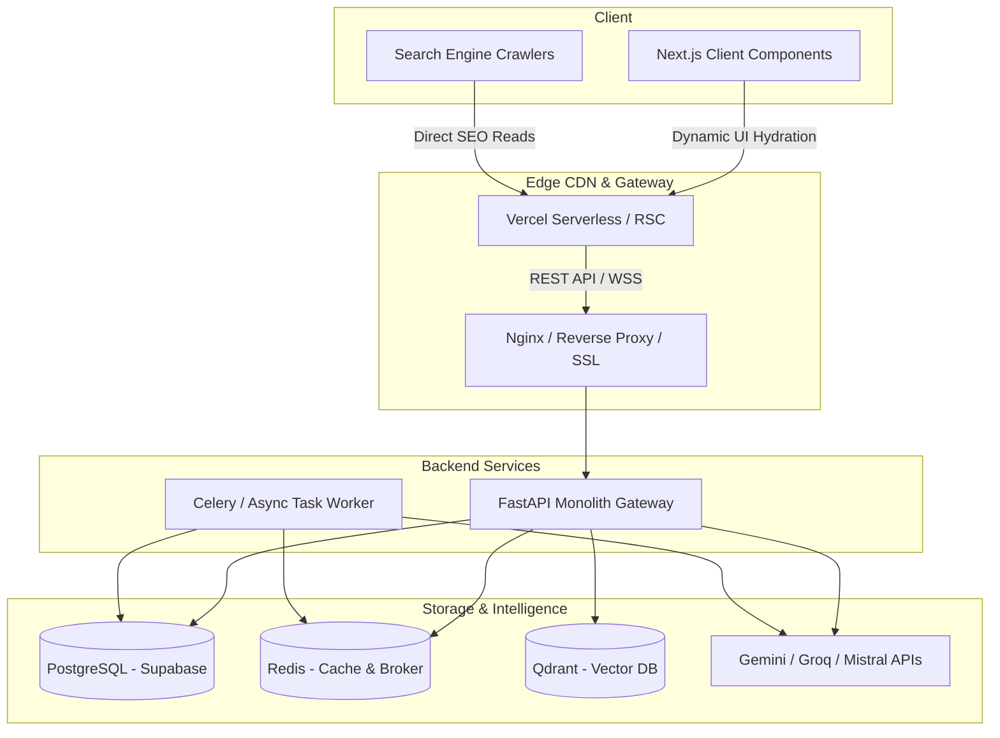
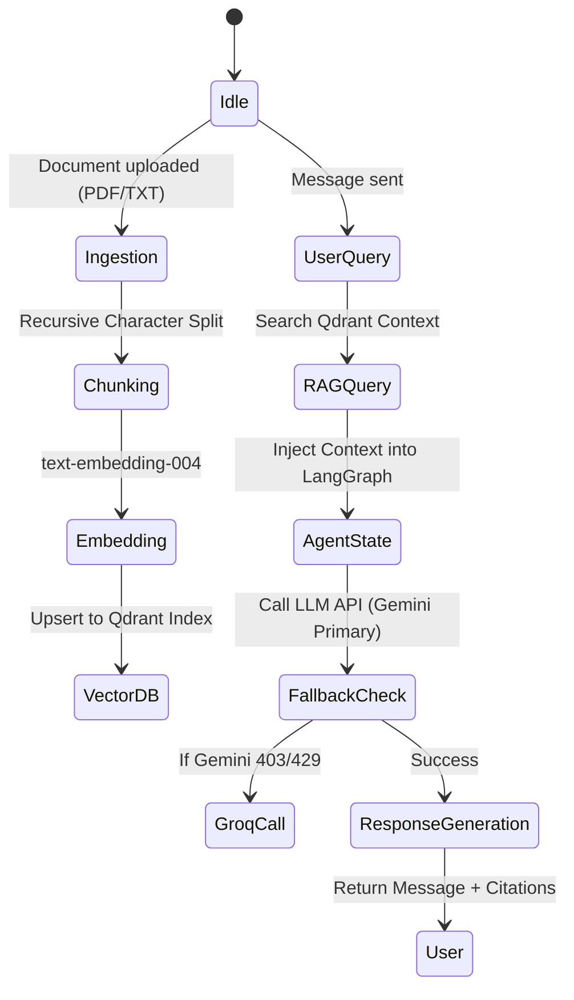
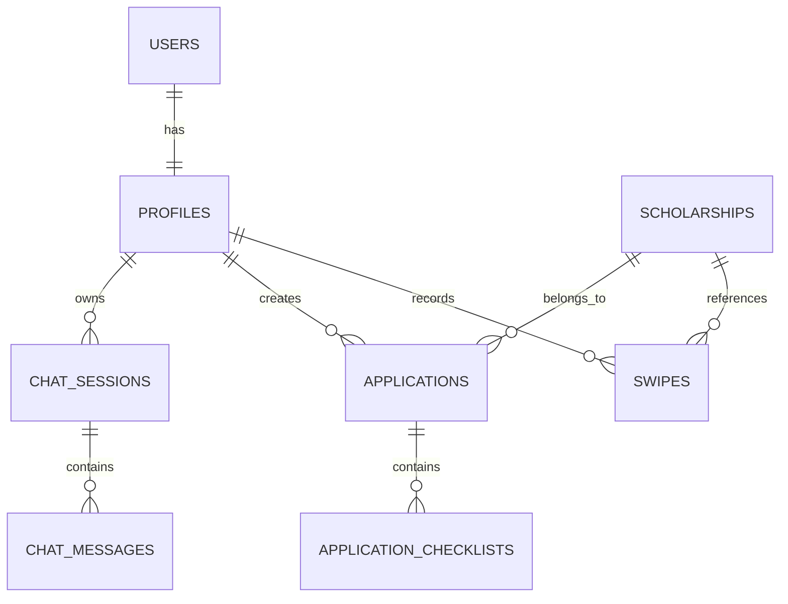
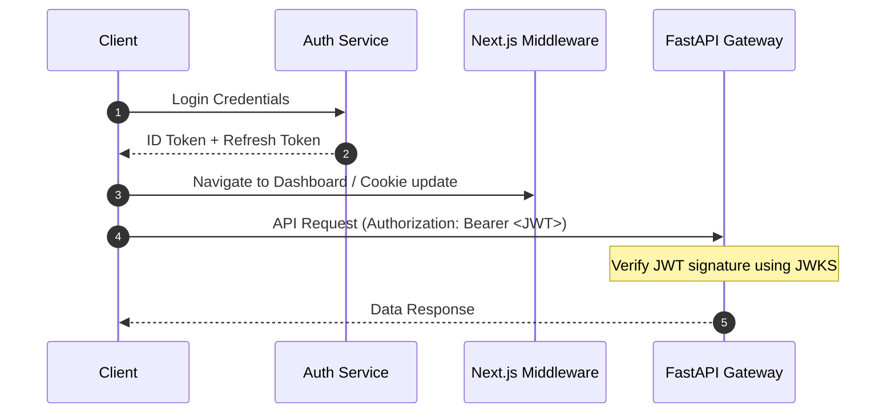

# 🏗️ FlyAI Web Architecture Redesign Blueprint
**Document Version:** 1.0.0  
**Authors:** Principal Software Architect & AI Infrastructure Architect  
**Status:** Approved for Implementation

---

## 1. Executive Summary
FlyAI is transitioning from a mobile-first Flutter application to a premium, production-ready, global-scale web platform. The platform empowers students globally to discover international scholarships, evaluate eligibility using AI, orchestrate visa/admission applications, and obtain continuous guidance through a structured AI-coaching framework.

This document defines the Next.js 15 (App Router) + FastAPI architecture. It establishes strict clean coding standards, modular feature domain boundaries, a multi-LLM orchestration layer (via LangGraph/Gemini/Groq), and a hybrid relational/vector database strategy to support rapid growth towards millions of active users.

---

## 2. Vision & Product Evolution
FlyAI aims to evolve from a basic scholarship aggregator into the universal intelligence layer for global student mobility.

```
[ Phase 1: Aggregation ] ──> [ Phase 2: RAG & Chat ] ──> [ Phase 3: Agentic Execution ] ──> [ Phase 4: Platform SDK ]
  - Scraping & Discovery        - Multi-model assistant     - Automated document check    - University APIs
  - Static Swiping & Likes      - Dynamic action plans      - Active visa submission       - Organizations
```

To support this evolution, the codebase must enforce:
- **Strict Decoupling:** Business domain logic is independent of UI rendering frameworks.
- **Provider Agnosticism:** Chat services and vector databases must use interface wrappers so they can be hot-swapped without modifying application cores.

---

## 3. Architectural Decisions (ADR)

### ADR 001: Next.js 15 App Router over Single Page Application (SPA)
*   **Context:** Search Engine Optimization (SEO) is critical for driving organic traffic to scholarship pages.
*   **Decision:** Implement Next.js 15 App Router (React 19) with Server Components (RSC) by default.
*   **Consequence:** Dynamic pages (e.g. `/scholarships/[id]`) are fully rendered on the server (SSG/ISR with fallback) for instant load speeds and perfect crawler indexing, while interactive features (e.g., matching feeds, chat boxes) use client-side hydration.

### ADR 002: Modular Monolith Repository Structure
*   **Context:** Evolving from a single codebase into multiple microservices can lead to high DevOps overhead in the startup phase.
*   **Decision:** Maintain a double-directory project structure (`frontend/` + `backend/`) within the same workspace (`flyai-web/`).
*   **Consequence:** Simple local orchestration via Docker Compose. Clear boundaries allow deploying the frontend directly to Vercel and the backend to Render, AWS ECS, or GCP Cloud Run independently.

### ADR 003: Hybrid Vector Search (SQL pgvector / Qdrant)
*   **Context:** Real-time semantic matching requires indexing large scholarship documents alongside user academic history.
*   **Decision:** Use Supabase PostgreSQL as primary SQL persistence, but leverage Qdrant as the dedicated production vector database for low-latency similarity queries.
*   **Consequence:** Primary transactional workflows are kept safe in PostgreSQL, while resource-heavy semantic searches run on Qdrant.

---

## 4. Technology Stack

| Layer | Technology Chosen | Purpose / Justification |
| :--- | :--- | :--- |
| **Frontend UI** | Next.js 15, TypeScript, React 19 | Server Component rendering, dynamic layouts, static generation |
| **Styling** | Tailwind CSS, Radix UI, shadcn/ui | Premium Design Tokens, consistent component layouts |
| **Client State** | TanStack Query v5 + Zustand | Server-state caching, minimal client-side state footprints |
| **Backend Core** | FastAPI (Python 3.13) | Asynchronous request processing, native Pydantic schemas, auto-docs |
| **ORM** | SQLAlchemy 2.0 (Async) + Alembic | Strongly-typed async DB interactions, migrations tracking |
| **Vector DB** | Qdrant | Fast HNSW vector index search, semantic payload filtering |
| **Orchestration** | LangGraph + LangChain | State-machine based conversational AI flow and RAG routing |
| **Caching/Bus** | Redis | Rate-limiting, task session caching, pub/sub for push events |

---

## 5. High-Level Architecture Diagram



---

## 6. Frontend Architecture

The frontend follows Next.js App Router conventions, modularized by features.

### Directory Structure
```text
frontend/
├── src/
│   ├── app/                    # Next.js App Router (Layouts & Server Pages)
│   │   ├── (auth)/             # Route Group: login, signup, reset
│   │   ├── (dashboard)/        # Route Group: main shell, feed, settings
│   │   ├── scholarships/       # Public static-generated scholarship detail routes
│   │   └── api/                # Next.js edge handlers / proxy rules
│   ├── components/             # Reusable global design system UI components
│   │   ├── ui/                 # shadcn/ui base elements
│   │   └── layout/             # Navigation bars, Sidebar, FloatNavBar
│   ├── features/               # Independent business modules
│   │   ├── swipe/              # Matching swipe deck & algorithm controls
│   │   ├── assistant/          # AI chat, session lists, file previewers
│   │   └── applications/       # Checklist management, calendar deadlines
│   ├── hooks/                  # Global shared react hooks (e.g. useAuth, useMedia)
│   ├── lib/                    # Initializers (queryClient, supabaseClient)
│   ├── services/               # API clients (fetch wrapper for backend routes)
│   └── store/                  # Client-only stores (Zustand)
```

### Component Design Rule
- **Server Components (RSC):** Fetch raw data directly or from backend services. Render layout structure, tables, and description fields.
- **Client Components (`"use client"`):** Used only when UI needs hooks (`useState`, `useEffect`), animations (Framer Motion), or third-party event listeners.

---

## 7. Backend Architecture

FastAPI provides type-safety and async operations natively. We implement clean DDD layering.

```text
backend/
├── app/
│   ├── main.py                 # Application bootstrap and middleware setup
│   ├── api/                    # Presentation Layer: Route handlers & endpoints
│   │   ├── v1/
│   │   │   ├── auth.py
│   │   │   ├── scholarships.py
│   │   │   └── chat.py
│   ├── core/                   # Shared config, logging, security tokens
│   ├── domain/                 # Core domain logic, schemas, rules
│   │   ├── models.py           # SQLAlchemy declarative ORM models
│   │   └── schemas.py          # Pydantic DTO validation schemas
│   ├── repositories/           # Infrastructure Layer: DB query encapsulations
│   │   ├── base.py
│   │   └── scholarship_repo.py
│   └── services/               # Application Layer: RAG orchestration & Agent code
│       ├── matching_engine.py
│       └── ai_agent.py
```

---

## 8. AI & Agent Architecture

The AI layer relies on a structured **RAG pipeline** and a state-machine driven **scholarship coach (FlyAgent)**.



### Citation Engine Specs
Every assistant response returning facts from scholarships must contain markdown-formatted source links:
`Ce programme de master finance les frais d'inscription à hauteur de 100% [Erasmus Mundus](scholarship_id).`

---

## 9. Database Architecture (Entity Relationship & Indices)



### Table Definitions & Core Indices
```sql
-- Profiles table linked to auth
CREATE TABLE profiles (
    id UUID PRIMARY KEY REFERENCES auth.users(id) ON DELETE CASCADE,
    full_name TEXT NOT NULL,
    nationality VARCHAR(100),
    degree_level VARCHAR(50),
    field_of_study TEXT,
    cv_url TEXT,
    created_at TIMESTAMPTZ DEFAULT NOW()
);

-- Scholarships Table
CREATE TABLE scholarships (
    id VARCHAR(50) PRIMARY KEY,
    title TEXT NOT NULL,
    provider TEXT NOT NULL,
    country VARCHAR(100) NOT NULL,
    degree_level VARCHAR(50)[] DEFAULT '{}',
    funding_type VARCHAR(20) CHECK (funding_type IN ('TOTAL', 'PARTIEL', 'INCONNU')),
    deadline DATE,
    description TEXT,
    active BOOLEAN DEFAULT TRUE,
    created_at TIMESTAMPTZ DEFAULT NOW()
);

CREATE INDEX idx_scholarships_lookup ON scholarships (active, deadline);
CREATE INDEX idx_scholarships_degree ON scholarships USING gin (degree_level);
```

---

## 10. API Design (Endpoints v1)

| Endpoint | Method | Payload / Query | Description |
| :--- | :--- | :--- | :--- |
| `/api/v1/auth/session` | `GET` | Headers: Bearer token | Verifies current JWT and loads permissions |
| `/api/v1/scholarships/match`| `POST` | `AcademicProfile` | Runs vector + logic match for scholarship scoring |
| `/api/v1/chat/sessions` | `GET` | Page/limit | Fetches chat session histories |
| `/api/v1/chat/messages` | `POST` | `SessionId, Prompt, FileBase64` | Routes prompt through Multi-LLM RAG pipeline |
| `/api/v1/applications` | `POST` | `ScholarshipId` | Instantiates a scholarship checklist tracking session |

---

## 11. Authentication & Security Flows

Authentication is handled securely on the edge using Supabase / Firebase Auth. JWT tokens are verified by FastAPI middleware.



---

## 12. Modular Feature Domains

Features are written as independent vertical slices.
-   **Presentation Layer:** Exposes the UI layout (`Next.js`) or Route controller (`FastAPI`).
-   **Application Layer:** Contains React queries, hooks, state providers, and FastAPI business logic orchestrators.
-   **Domain Layer:** Core mathematical logic (e.g. matching score algorithms), models, interfaces.
-   **Infrastructure Layer:** Database access, file system storage, API integrations.

---

## 13. Deployment Strategy

We utilize Dockerized containers for isolated, clean, reproducible runtime deployments.

```text
Production Deployment Flow:
[GitHub PR Merge] ──> [CI: Lint & Test] ──> [Docker Image Build] ──> [Deploy to GCP/AWS via Cloud Run/ECS]
                                                                  ──> [Deploy Next.js Assets to Vercel CDN]
```

---

## 14. Enterprise Security Specifications
-   **Rate Limiting:** IP-based token-bucket rate limiting implemented inside Redis middleware.
-   **Input Validation:** Complete validation on all request entries via Pydantic on the backend, and Zod schemas on the frontend.
-   **CORS Configuration:** Explicit origin filters mapping client production hostnames.

---

## 15. Scalability Blueprint
-   **Read Optimization:** Redis cache layers for static lookup arrays (countries, degree classes).
-   **Asynchronous Tasks:** Move file chunking and vector index refreshes to Celery background workers.
-   **Database Sharding:** Configure read-replicas for the Supabase SQL database as query metrics grow.

---

## 16. Performance Guidelines
-   **Web Vitals Target:** Next.js LCP < 1.5s, FID < 100ms, CLS < 0.1.
-   **Caching Strategy:** Cache public `/scholarships` pages at the edge using ISR (Incremental Static Regeneration) with a 24-hour revalidation window.

---

## 17. DevOps & Orchestration

We supply a production-grade [docker-compose.yml](file:///c:/Users/netha/Dev/FlyAI-app/flyai-web/docker-compose.yml) in the repository to orchestrate PostgreSQL, Redis, Qdrant, and FastAPI local instances.

---

## 18. Testing Strategy
-   **Unit Testing:** `pytest` in backend modules with mock database connections.
-   **E2E Testing:** Playwright in Next.js test directories.
-   **AI Evaluation:** Assertions on LLM outputs using Ragas/G-Eval tests during CI builds.

---

## 19. Future Roadmap
-   **Q4 2026:** Roll out native PDF parser model for automated university transcripts.
-   **Q1 2027:** Implement a dynamic mentor/alumni peer matching board.

---

## 20. Best Practices
-   **Semantic Commit Messages:** `feat(chat): added pdf upload integration`, `fix(auth): solved jwt edge logout bug`.
-   **Coding Guidelines:** Enforce TypeScript strict mode, ESLint styling rules, and black/ruff code formatters in the Python application.
